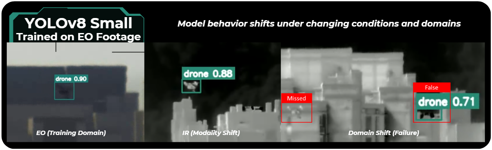

<!-- ===================================================== -->
<!--                     HEADER                            -->
<!-- ===================================================== -->

<h1 align="center">IRIS Experiments</h1>

  <strong>Structured Exploration. Real-World Learning.</strong>

  Experiments designed to understand how computer vision models behave across conditions, domains, and problem definitions.

  <a href="#featured-experiments">Explore Experiments</a> •
  <a href="#what-these-experiments-show">What We Learn</a> •
  <a href="#methodology">Methodology</a> •
  <a href="#how-this-fits-into-iris">Ecosystem</a>

---

  

---

<!-- ===================================================== -->
<!--                     BADGES                            -->
<!-- ===================================================== -->

  
  
  
  

---

> Experiments are published as they are completed to reflect real-world findings, not staged results.

---

<!-- ===================================================== -->
<!--                 WHAT THIS IS                          -->
<!-- ===================================================== -->

## What This Repository Is

This repository is the **learning layer** of IRIS.

It is where models are tested under changing conditions, domains, and assumptions to understand how they behave in the real world.

Experiments are not isolated training runs.

They are structured investigations designed to answer specific questions about model performance.

---

<!-- ===================================================== -->
<!--                 WHY IT EXISTS                         -->
<!-- ===================================================== -->

## Why This Exists

Most experimentation in computer vision focuses on improving a metric.

It does not answer:
- how models behave when environments change  
- how performance transfers across domains  
- how problem definition impacts results  

IRIS Experiments focuses on:

- **testing assumptions, not just tuning models**  
- **understanding behavior across conditions**  
- **evaluating how data and definitions shape outcomes**  

---

<!-- ===================================================== -->
<!--                 CURRENT STATUS                        -->
<!-- ===================================================== -->

## Current Status

This repository is actively being developed.

Initial experiment tracks are being defined and will be published as they are completed.

The goal is to build a set of experiments that reflect real-world challenges, not idealized scenarios.

---

<!-- ===================================================== -->
<!--               INITIAL DIRECTION                       -->
<!-- ===================================================== -->

## Initial Direction

Current work is focused on understanding how model behavior changes across:

### Cross-Condition

- EO vs IR performance  
- lighting and visibility changes  
- distance and object scale  

---

### Cross-Domain

- applying EO-trained models to IR data  
- generalization across environments  
- performance under domain shift  

---

### Problem Definition

- ontology granularity (broad vs specific classes)  
- contextual classes and their impact on false positives  
- how class design influences detection behavior  

---

These themes are already reflected in benchmark comparisons and will be formalized into structured experiments.

---

<!-- ===================================================== -->
<!--                WHAT THESE EXPERIMENTS SHOW            -->
<!-- ===================================================== -->

## What These Experiments Show

Model performance is not fixed.

It changes based on:
- environment  
- data source  
- problem definition  

The same model can:
- perform well in one modality and fail in another  
- generalize poorly across domains  
- behave differently depending on class definitions  

These are not edge cases.

They are expected outcomes when models interact with real-world variability.

As experiments are published, this repository will document how these factors influence real-world system behavior.

---

<!-- ===================================================== -->
<!--                 METHODOLOGY                           -->
<!-- ===================================================== -->

## Methodology

Experiments in IRIS are designed to answer specific questions about model behavior.

Each experiment isolates a variable and evaluates its impact under controlled conditions.

---

### Experiment Types

**Cross-Condition**
- EO vs IR  
- lighting and visibility  
- distance and scale  

**Cross-Domain**
- training vs deployment domain mismatch  
- transfer across sensor types  

**Ontology and Definition**
- class granularity  
- contextual classes  
- class boundary design  

---

### Evaluation Approach

Experiments are evaluated using:

- standard metrics (mAP, mAR, IoU)  
- qualitative inspection of behavior  
- comparison against baseline conditions  

---

<strong>Why This Matters</strong>

Many performance issues do not originate from model architecture.

They emerge from:
- data mismatch  
- environmental change  
- poorly defined class structures  

Understanding these factors is critical to building reliable systems.

---

<!-- ===================================================== -->
<!--                HOW THIS FITS INTO IRIS                -->
<!-- ===================================================== -->

## How This Fits Into IRIS

IRIS is structured as a lifecycle for understanding and deploying computer vision systems.

**Flow:**

- **Benchmark** → compare model behavior under controlled conditions  
- **Experiments** → explore how models behave across changing conditions, domains, and definitions  
- **Model Zoo** → deploy models validated through this process  

  

---

<!-- ===================================================== -->
<!--                RELATED REPOS                          -->
<!-- ===================================================== -->

## Related Repositories

- **IRIS Benchmark**  
  Structured comparison and evaluation  
  → [[Benchmarks](https://github.com/iris-computer-vision/iris-benchmark)]

- **IRIS Model Zoo**  
  Deployment-ready models  
  → [[ModelZoo](https://github.com/iris-computer-vision/iris-model-zoo/)]

---

<!-- ===================================================== -->
<!--                EXTERNAL LINKS                         -->
<!-- ===================================================== -->

## External Resources

Check out the [IRIS](https://iriscomputervision.ai/) webpage for all the latest news and updates!
- Hugging Face Models → [[HF](https://huggingface.co/IRIS-Computer-Vision/models)] 
- Case Studies → [[Here](https://iriscomputervision.ai/case-studies/)]

---

  <strong>IRIS is built for lifecycle-driven computer vision.</strong>

